# Sơ đồ ERD - Novel Backend Database

## Mô tả chung

Hệ thống quản lý và đọc truyện Light Novel trực tuyến với khả năng crawl tự động từ trang Syosetu (小説家になろう - Shousetsuka ni Narou) của Nhật Bản và dịch tự động sang tiếng Việt.

### Các module chính:

**1. Authentication & Authorization**
- Đăng ký/đăng nhập với email và password (bcrypt hashing)
- Phân quyền dựa trên roles (admin, user, moderator)
- Upload avatar lưu trữ trên Cloudinary
- Reset password qua email với token có thời hạn
- Onboarding cho người dùng mới để cá nhân hóa trải nghiệm

**2. Content Management**
- Crawl truyện từ Syosetu.com thông qua job queue system
- Lưu trữ song ngữ: nội dung gốc (tiếng Nhật) + bản dịch (tiếng Việt)
- Quản lý metadata: title, author, description, cover image, source URL
- Đánh dấu featured stories hiển thị trên trang chủ
- Theo dõi view count, average rating, total ratings

**3. User Interactions**
- **Ratings**: Đánh giá 1-5 sao (mỗi user chỉ rate 1 lần/truyện, có thể cập nhật)
- **Comments**: Viết review và chia sẻ cảm nhận về truyện
- **Favorites**: Bookmark truyện yêu thích để đọc sau
- **Reading History**: Lưu tiến độ đọc (progress %, scroll position, last chapter)

**4. Recommendation System**
- Vector embeddings (768 chiều) cho stories và user profiles
- Collaborative filtering dựa trên hành vi người dùng tương tự
- Content-based filtering dựa trên genres và đặc điểm truyện
- Hybrid approach kết hợp cả hai phương pháp
- Tracking metrics: completion rate, reading velocity, genre diversity score

**5. Categorization & Search**
- Phân loại theo genres (Fantasy, Romance, Action, Isekai, etc.)
- Quan hệ many-to-many: một truyện có nhiều thể loại
- Full-text search trên title và description (PostgreSQL tsvector)

## Sơ đồ ERD (Mermaid - Horizontal Layout)

```mermaid
graph LR
    %% Users & Auth
    users["<b>👤 USERS</b><br/>───────────────<br/>🔑 id PK<br/>📧 email UK<br/>🔒 password_hash<br/>👤 display_name<br/>✅ active<br/>🖼️ avatar_url<br/>🔗 role_id FK<br/>📅 created_at"]
    
    roles["<b>🔐 ROLES</b><br/>───────────────<br/>🔑 id PK<br/>📝 name UK<br/>📄 description<br/>📅 created_at"]
    
    profiles["<b>👥 USER_PROFILES</b><br/>───────────────<br/>🔑 id PK<br/>🔗 user_id FK,UK<br/>🧬 profile_embedding<br/>📊 total_stories_read<br/>📊 total_chapters_read<br/>📈 average_completion_rate<br/>⚡ chapters_per_week<br/>⏱️ avg_session_duration_minutes<br/>🎨 genre_diversity_score<br/>📅 last_profile_update<br/>📅 created_at<br/>📅 updated_at"]
    
    onboarding["<b>🎯 ONBOARDING</b><br/>───────────────<br/>🔑 id PK<br/>🔗 user_id FK,UK<br/>🏷️ preferred_genres<br/>📆 reading_frequency<br/>📏 preferred_length<br/>✔️ completion_preference<br/>🚀 exploration_preference<br/>✅ completed<br/>📅 created_at"]
    
    tokens["<b>🔑 RESET_TOKENS</b><br/>───────────────<br/>🔑 id PK<br/>🎫 token UK<br/>🔗 user_id FK<br/>⏰ expiry_date<br/>✅ used<br/>📅 created_at"]
    
    %% Stories & Content
    stories["<b>📚 STORIES</b><br/>───────────────<br/>🔑 id PK<br/>📖 title<br/>🇯🇵 raw_title<br/>🇻🇳 translated_title<br/>✍️ author_name<br/>🇯🇵 raw_author_name<br/>🇻🇳 translated_author_name<br/>📝 description<br/>🇯🇵 raw_description<br/>🇻🇳 translated_description<br/>🖼️ cover_image_url<br/>🔗 source_url<br/>🌐 source_site<br/>📊 status<br/>⭐ featured<br/>👁️ view_count<br/>⭐ average_rating<br/>🔢 total_ratings<br/>🧬 embedding 768D<br/>📅 created_at<br/>📅 updated_at<br/>🔗 created_by FK<br/>🔗 last_modified_by FK"]
    
    chapters["<b>📖 STORY_CHAPTERS</b><br/>───────────────<br/>🔑 id PK<br/>🔗 story_id FK<br/>🔢 chapter_index<br/>📖 title<br/>🇯🇵 raw_title<br/>🇻🇳 translated_title<br/>🇯🇵 raw_content<br/>🇻🇳 translated_content<br/>📊 crawl_status<br/>📊 translate_status<br/>⏰ crawl_time<br/>⏰ translate_time<br/>📅 created_at<br/>📅 updated_at<br/>🔗 created_by FK<br/>🔗 last_modified_by FK"]
    
    genres["<b>🏷️ GENRES</b><br/>───────────────<br/>🔑 id PK<br/>📝 name UK<br/>📄 description<br/>📅 created_at"]
    
    story_genres["<b>📑 STORY_GENRES</b><br/>───────────────<br/>🔗 story_id PK,FK<br/>🔗 genre_id PK,FK"]
    
    crawl["<b>🔄 CRAWL_JOBS</b><br/>───────────────<br/>🔑 id PK<br/>🔗 story_id FK<br/>🔗 chapter_id FK<br/>📝 job_type<br/>📊 status<br/>🔁 attempts<br/>❌ error_message<br/>📅 created_at<br/>📅 updated_at<br/>🔗 created_by FK<br/>🔗 last_modified_by FK"]
    
    %% User Interactions
    history["<b>📜 READING_HISTORY</b><br/>───────────────<br/>🔑 id PK<br/>🔗 user_id FK<br/>🔗 story_id FK<br/>🔗 chapter_id FK<br/>📊 progress_percent<br/>📍 scroll_offset<br/>⏰ last_read_at"]
    
    ratings["<b>⭐ RATINGS</b><br/>───────────────<br/>🔑 id PK<br/>🔗 user_id FK<br/>🔗 story_id FK<br/>⭐ rating 1-5<br/>📅 created_at<br/>📅 updated_at"]
    
    comments["<b>💬 COMMENTS</b><br/>───────────────<br/>🔑 id PK<br/>🔗 user_id FK<br/>🔗 story_id FK<br/>📝 content<br/>📅 created_at<br/>📅 updated_at"]
    
    favorites["<b>❤️ FAVORITES</b><br/>───────────────<br/>🔑 id PK<br/>🔗 user_id FK<br/>🔗 story_id FK<br/>📅 created_at"]
    
    %% Relationships - Users & Auth
    users -->|1:1| roles
    users -->|1:1| profiles
    users -->|1:0..1| onboarding
    users -->|1:N| tokens
    
    %% Relationships - Stories & Content
    stories -->|1:N| chapters
    stories -.->|N:M| story_genres
    genres -.->|N:M| story_genres
    stories -->|1:N| crawl
    chapters -->|1:N| crawl
    
    %% Relationships - User Interactions
    users -->|1:N| history
    stories -->|1:N| history
    chapters -->|1:N| history
    
    users -->|1:N| ratings
    stories -->|1:N| ratings
    
    users -->|1:N| comments
    stories -->|1:N| comments
    
    users -->|1:N| favorites
    stories -->|1:N| favorites
    
    %% Audit trails
    users -.->|creates| stories
    users -.->|creates| chapters
    
    classDef userClass fill:#e1f5ff,stroke:#01579b,stroke-width:2px
    classDef contentClass fill:#fff3e0,stroke:#e65100,stroke-width:2px
    classDef interactionClass fill:#f3e5f5,stroke:#4a148c,stroke-width:2px
    classDef systemClass fill:#e8f5e9,stroke:#1b5e20,stroke-width:2px
    
    class users,roles,profiles,onboarding,tokens userClass
    class stories,chapters,genres,story_genres contentClass
    class history,ratings,comments,favorites interactionClass
    class crawl systemClass
```

---

## Chi tiết các bảng

### 1. users - Quản lý người dùng
Lưu trữ thông tin tài khoản người dùng với authentication và profile cơ bản.
- **Security**: Password được hash bằng bcrypt
- **Avatar**: Upload và lưu trên Cloudinary CDN
- **Status**: Có thể active/deactivate tài khoản

### 2. roles - Phân quyền
Định nghĩa các vai trò trong hệ thống (admin, user, moderator).
- Mỗi user có 1 role duy nhất
- Dùng cho authorization và access control

### 3. stories - Truyện
Lưu trữ metadata và nội dung truyện với hỗ trợ đa ngôn ngữ.
- **Dual-language support**:
  - Title: `raw_title` (Japanese) + `translated_title` (Vietnamese) + `title` (display)
  - Author: `raw_author_name` (Japanese) + `translated_author_name` (Vietnamese) + `author_name` (display)
  - Description: `raw_description` (Japanese) + `translated_description` (Vietnamese) + `description` (display)
- **Vector embedding**: 768 chiều cho recommendation system
- **Source tracking**: `source_url` (Syosetu URL) + `source_site` (default: 'syosetu')
- **Analytics**: `view_count`, `average_rating` (1.0-5.0), `total_ratings`
- **Status management**: `status` (PUBLISHED, DRAFT, DELETED) + `featured` (homepage highlight)
- **Audit trail**: `created_by`, `last_modified_by`, `created_at`, `updated_at`

### 4. story_chapters - Chương truyện
Nội dung từng chương với tracking status crawl và dịch.
- **Sequential ordering**: `chapter_index` (thứ tự chương)
- **Dual-language content**:
  - Title: `raw_title` (Japanese) + `translated_title` (Vietnamese) + `title` (display)
  - Content: `raw_content` (Japanese) + `translated_content` (Vietnamese)
- **Status tracking**: 
  - `crawl_status` (PENDING, COMPLETED, FAILED) + `crawl_time`
  - `translate_status` (NONE, IN_PROGRESS, COMPLETED) + `translate_time`
- **Timestamps**: `created_at`, `updated_at`
- **Audit trail**: `created_by`, `last_modified_by`

### 5. genres - Thể loại
Phân loại truyện theo các thể loại (Fantasy, Romance, Isekai, Action...).
- Quan hệ many-to-many với stories
- Dùng cho filtering và recommendation

### 6. story_genres - Junction table
Liên kết many-to-many giữa stories và genres.
- Composite primary key (story_id, genre_id)

### 7. user_history_read - Lịch sử đọc
Theo dõi tiến độ đọc chi tiết của từng user.
- **Progress tracking**: Percentage và scroll position
- **Last chapter**: Chapter cuối cùng đọc
- **Unique constraint**: Mỗi user chỉ có 1 record/story

### 8. ratings - Đánh giá
Hệ thống rating 1-5 sao cho truyện.
- **Unique constraint**: Mỗi user chỉ rate 1 lần/story
- **Updateable**: Có thể thay đổi rating
- Dùng để tính average_rating cho stories

### 9. comments - Bình luận
Reviews và feedback từ người đọc.
- User có thể viết nhiều comments cho 1 story
- Có timestamp để sắp xếp theo thời gian

### 10. favorites - Yêu thích
Bookmark truyện để đọc sau.
- **Unique constraint**: Mỗi user chỉ favorite 1 lần/story
- Quick access đến truyện yêu thích

### 11. crawl_jobs - Queue crawl
Quản lý job queue cho việc crawl từ Syosetu.
- **Job targeting**: `story_id` (crawl story metadata) hoặc `chapter_id` (crawl chapter content)
- **Job type**: `job_type` (STORY, CHAPTER)
- **Retry mechanism**: `status` (PENDING, IN_PROGRESS, COMPLETED, FAILED) + `attempts` + `error_message`
- **Timestamps**: `created_at`, `updated_at`
- **Audit trail**: `created_by`, `last_modified_by`

### 12. user_profiles - Profile nâng cao
Aggregated data về hành vi đọc của user.
- **Vector embedding**: Profile dựa trên stories đã đọc
- **Reading metrics**: Completion rate, velocity, session duration
- **Genre diversity**: Đo độ đa dạng sở thích đọc (0-1.0)
- Dùng cho hybrid recommendation system

### 13. user_onboarding - Onboarding
Thu thập preferences từ người dùng mới lần đầu.
- **Genre preferences**: Thể loại yêu thích
- **Reading habits**: Tần suất, độ dài truyện ưa thích
- **Exploration style**: Conservative vs Adventurous
- Giúp cá nhân hóa recommendations ngay từ đầu

### 14. password_reset_tokens - Reset mật khẩu
Quản lý tokens cho việc reset password qua email.
- **Security**: UUID token, 24h expiry
- **One-time use**: Đánh dấu `used` sau khi dùng
- Auto-cleanup tokens hết hạn

---

## ✅ Verification Checklist - Đầy đủ các cột từ Database

| Bảng | Tổng cột DB | Cột trong ERD | Status |
|------|-------------|---------------|--------|
| **users** | 8 | id, email, password_hash, display_name, created_at, active, avatar_url, role_id | ✅ 8/8 |
| **roles** | 4 | id, name, description, created_at | ✅ 4/4 |
| **stories** | 23 | id, title, raw_title, translated_title, author_name, raw_author_name, translated_author_name, description, raw_description, translated_description, cover_image_url, source_url, source_site, status, featured, view_count, average_rating, total_ratings, embedding, created_at, updated_at, created_by, last_modified_by | ✅ 23/23 |
| **story_chapters** | 16 | id, story_id, chapter_index, title, raw_title, translated_title, raw_content, translated_content, crawl_status, translate_status, crawl_time, translate_time, created_at, updated_at, created_by, last_modified_by | ✅ 16/16 |
| **genres** | 4 | id, name, description, created_at | ✅ 4/4 |
| **story_genres** | 2 | story_id, genre_id | ✅ 2/2 |
| **user_history_read** | 7 | id, user_id, story_id, chapter_id, progress_percent, scroll_offset, last_read_at | ✅ 7/7 |
| **ratings** | 6 | id, user_id, story_id, rating, created_at, updated_at | ✅ 6/6 |
| **comments** | 6 | id, user_id, story_id, content, created_at, updated_at | ✅ 6/6 |
| **favorites** | 4 | id, user_id, story_id, created_at | ✅ 4/4 |
| **crawl_jobs** | 11 | id, story_id, chapter_id, job_type, status, attempts, error_message, created_at, updated_at, created_by, last_modified_by | ✅ 11/11 |
| **user_profiles** | 12 | id, user_id, profile_embedding, total_stories_read, total_chapters_read, average_completion_rate, chapters_per_week, avg_session_duration_minutes, genre_diversity_score, last_profile_update, created_at, updated_at | ✅ 12/12 |
| **user_onboarding** | 9 | id, user_id, preferred_genres, reading_frequency, preferred_length, completion_preference, exploration_preference, completed, created_at | ✅ 9/9 |
| **password_reset_tokens** | 6 | id, token, user_id, expiry_date, used, created_at | ✅ 6/6 |

**Tổng kết**: ✅ **Tất cả 14 bảng đã có đầy đủ 118/118 cột từ database!**

